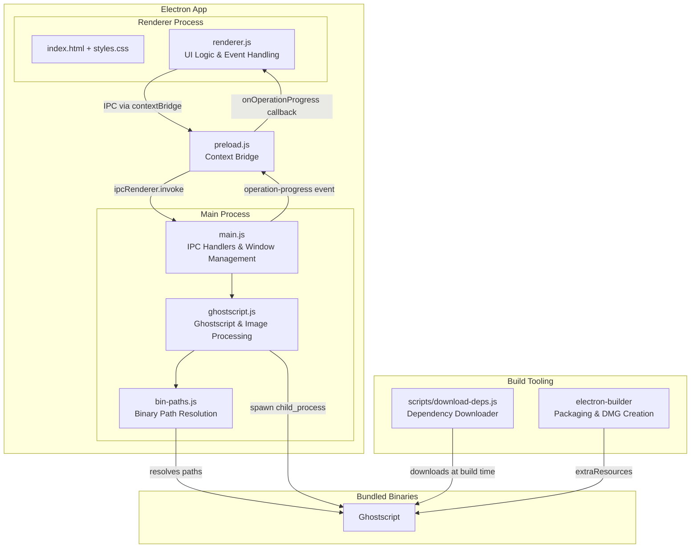
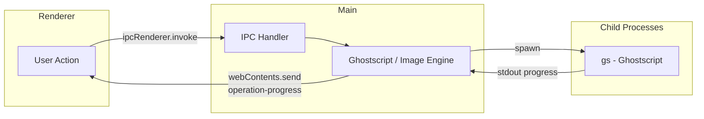
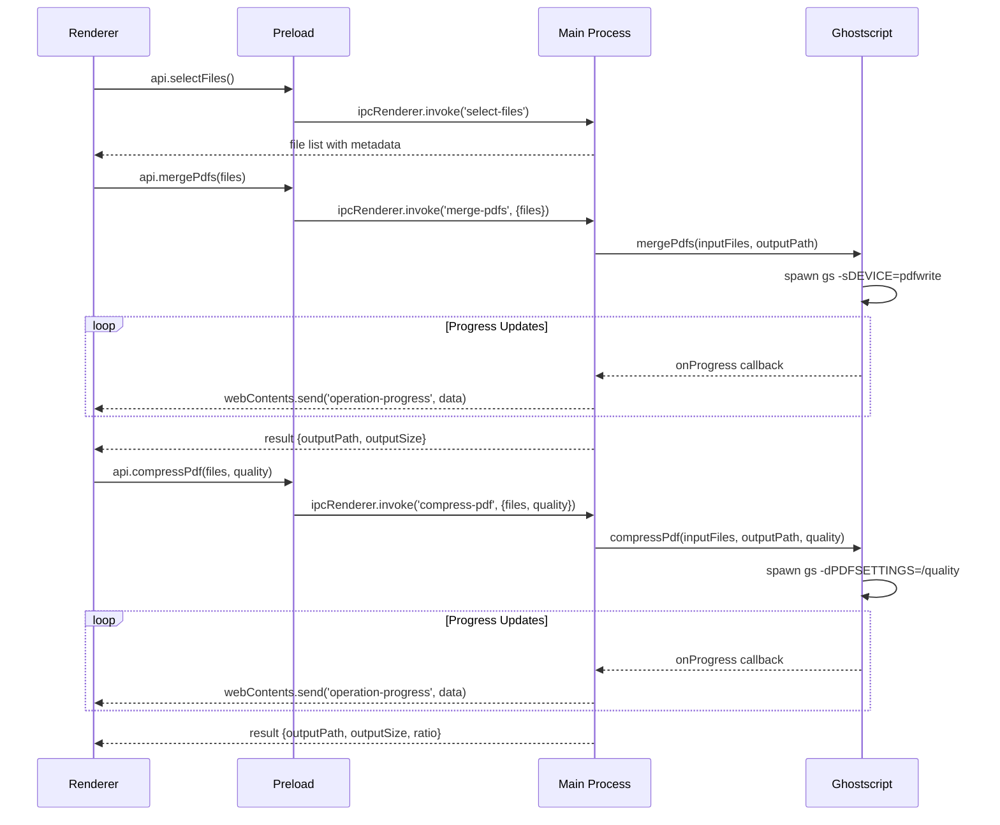
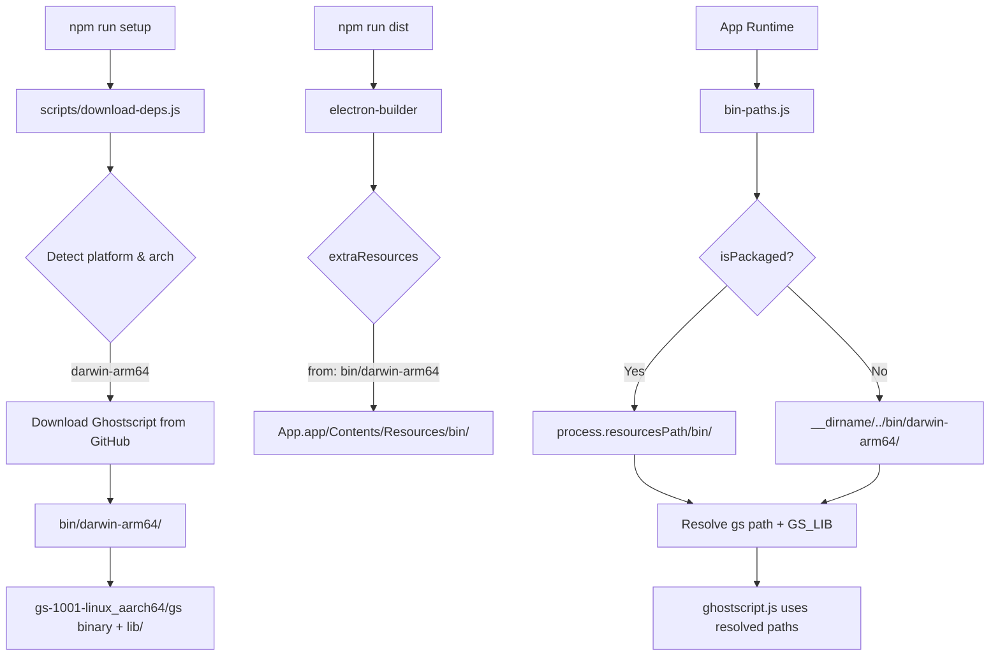

# PackPDF

A desktop application built with **Electron** that provides a GUI for compressing, merging, and converting files to PDF using **Ghostscript** as the backend engine. The app bundles the Ghostscript binary so it works out of the box with zero host-level prerequisites.

## Quick Start

```bash
# Install Node.js dependencies
npm install

# Download Ghostscript binary (~45MB)
npm run setup

# Run in development mode
npm run dev

# Package as .dmg for distribution
npm run dist

# Package as .app directory (no DMG)
npm run pack
```

---

## Architecture



---

## Process Model



---

## Module Responsibilities

### `main.js` — Main Process Entry Point

- Creates the `BrowserWindow` with hidden title bar and dark theme
- Registers IPC handlers for file selection, merging, compressing, and file operations
- Converts DOCX files to PDF using mammoth (DOCX→HTML) + Electron `printToPDF`
- Preprocesses input files by converting DOCX to temporary PDFs before merge/compress

### `preload.js` — Context Bridge

- Exposes a safe `window.api` object to the renderer via `contextBridge`
- Maps IPC channels to callable functions (`selectFiles`, `mergePdfs`, `compressPdf`, etc.)
- Provides `onOperationProgress` callback registration for progress events

### `src/renderer.js` — UI Logic

- Manages application state (active tab, file lists, drag-and-drop reordering)
- Handles file selection via drop zones and native file dialogs
- Renders file lists with drag-to-reorder support
- Displays compression quality selector (Maximum / Balanced / Minimum)
- Shows operation progress and result summaries

### `src/ghostscript.js` — PDF Processing Engine

- Wraps the Ghostscript CLI for PDF merging and compression
- Converts images (JPG, PNG, TIFF, BMP, GIF) to PDF — JPEG and PNG are converted natively in Node.js without Ghostscript for speed
- Builds minimal PDF files in-memory for JPEG (DCTDecode) and PNG (FlateDecode) images
- Parses JPEG SOF markers and PNG IHDR/IDAT chunks for direct image embedding
- Falls back to Ghostscript for other image formats

### `src/bin-paths.js` — Binary Path Resolution

- Detects whether the app is running in development or packaged mode
- Resolves path to the bundled Ghostscript binary and its library directory
- Provides environment variables (`GS_LIB`) for Ghostscript resource lookup
- Falls back to system-installed Ghostscript if bundled binary is not found

### `scripts/download-deps.js` — Build-Time Dependency Downloader

- Downloads platform-specific Ghostscript binary from GitHub Releases
- Supports macOS arm64 architecture
- Extracts tarball and places binaries in `bin/darwin-arm64/`
- Caches downloads — skips if binary already exists

---

## IPC Channel Map



| Channel | Direction | Purpose |
|---|---|---|
| `select-files` | Renderer → Main | Open native file picker (PDF, images, DOCX) |
| `merge-pdfs` | Renderer → Main | Merge selected files into a single PDF |
| `compress-pdf` | Renderer → Main | Compress selected files with quality setting |
| `operation-progress` | Main → Renderer | Stream progress updates (converting, merging, compressing) |
| `open-file` | Renderer → Main | Reveal output file in Finder |
| `get-gs-info` | Renderer → Main | Get Ghostscript version and path info |

---

## Supported Input Formats

| Format | Type | Conversion Method |
|---|---|---|
| PDF | Document | Native (no conversion needed) |
| JPG/JPEG | Image | Direct embedding via DCTDecode (no Ghostscript) |
| PNG | Image | Decoded & re-compressed via FlateDecode (no Ghostscript) |
| TIFF/TIF | Image | Ghostscript conversion |
| BMP | Image | Ghostscript conversion |
| GIF | Image | Ghostscript conversion |
| DOCX | Document | mammoth → HTML → Electron printToPDF |

---

## Compression Quality Levels

| Level | DPI | Ghostscript Setting | Use Case |
|---|---|---|---|
| Maximum | 72 | `-dPDFSETTINGS=/screen` | Smallest file size |
| Balanced | 150 | `-dPDFSETTINGS=/ebook` | Good quality (default) |
| Minimum | 300 | `-dPDFSETTINGS=/printer` | High quality print |

---

## Binary Dependency Management



---

## File Structure

```
packpdf/
├── main.js                  # Electron main process
├── preload.js               # Context bridge (renderer ↔ main)
├── package.json             # Dependencies & electron-builder config
├── src/
│   ├── index.html           # App UI markup
│   ├── styles.css           # App styling (dark theme)
│   ├── renderer.js          # UI logic & state management
│   ├── ghostscript.js       # Ghostscript wrapper & image-to-PDF
│   └── bin-paths.js         # Binary path resolution
├── scripts/
│   └── download-deps.js     # Ghostscript binary downloader
├── bin/
│   └── darwin-arm64/        # Downloaded binaries (gitignored)
│       └── gs-1001-linux_aarch64/
│           ├── gs
│           └── lib/
└── dist/                    # Build output (gitignored)
    └── PackPDF-*.dmg
```

---

## Build & Distribution

```mermaid
flowchart LR
    A[npm install] --> B[npm run setup]
    B --> C[Download Ghostscript<br/>to bin/darwin-arm64/]
    C --> D[npm run dist]
    D --> E[electron-builder]
    E --> F[Bundle app + extraResources]
    F --> G[Ad-hoc code sign]
    G --> H[PackPDF-1.0.0-arm64.dmg]
